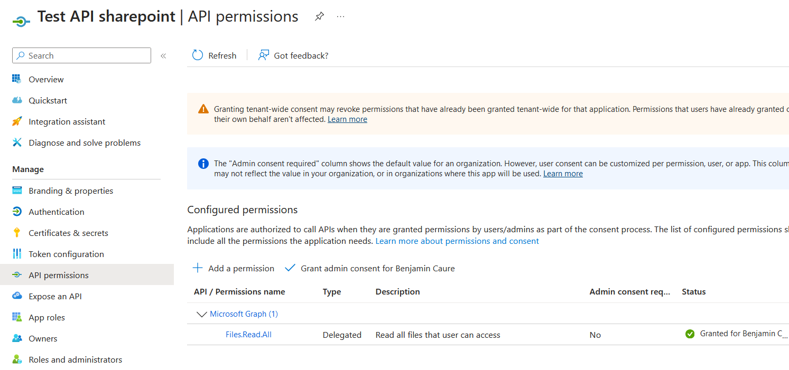

# Get documents using the Sharepoint API

## Architecture Overview

Here's all the options to access Sharepoint documents. 

In this project we explore the solution in **red** using Microsoft Graph:


## oAuth + javascript MSAL client

### Microsoft Entra (Azure AD)

We need to register our client app to be able to authenticate to the API and get the access token.

To register the client app, connect to the Microsoft Entra Portal.
- go to menu: Applications > App Registration
- click on "New Registration"
- fill the form
  - in the Authentication part, add "Single Page App"
  - add to "Redirect URIs": `http://localhost:4200`


  - configure "Implicit flow Access Token" 


- add a permission:
    - click on `Microsoft Graph`
    - select `Delegated`
    - type `Files.Read.All`



### Configure the MSAL client

To get the required information, connect to the Microsoft Entra Portal: 
- go to menu: Overview
- get the Primary domain
- go to menu: Applications > App Registration > {our javascript app name}
- get the client ID (app ID)


Copy these parameters to the auth.config.ts

### Authenticate

- Run the sample Angular app
- Open the dev tools (F12) and go to the network tab
- Sign in with your personal Michelin account
  - you must have permission to consult the files from the Sharepoint site


- Use MSAL framework to process the oAuth flow and exchange an ID token with an Access Token
  - in this sample, the Angular Interceptor will add Access Token automatically to all HTTP requests

### Call the Graph API

**See all these request in action in `sharepoint.service.ts`**

Get the Sharepoint site ID:

```
https://graph.microsoft.com/v1.0/sites/{primary domain prefix}.sharepoint.com:/sites/{site name} \
```

Get the drive ID from the site ID:

```
https://graph.microsoft.com/v1.0/sites/{site id}/drives
```

Get the root ID from the drive ID:

```
https://graph.microsoft.com/v1.0/sites/{site id}/drives/{drive id}/root
```

Get the children from the root ID:

```
https://graph.microsoft.com/v1.0/sites/{site id}/drives/{drive id}/items/${root id}/children
```

Then browse directory recursively and download files using the download URL from the response.
